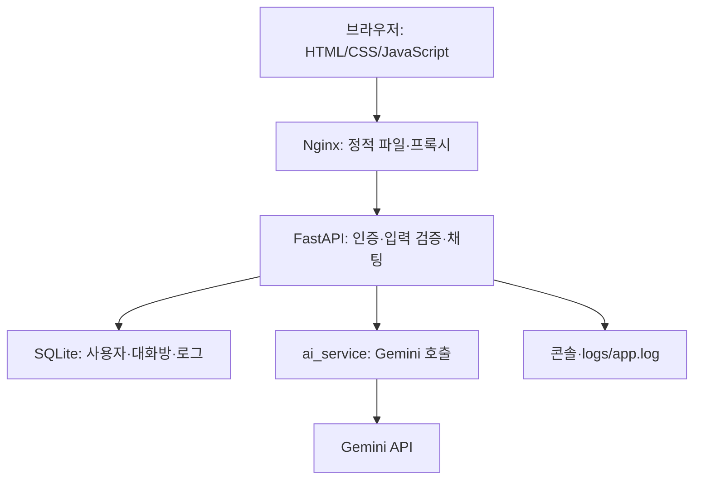

# AI Assistant — 반려동물 동반 국내여행 AI 챗봇

반려동물을 데리고 국내여행을 준비하는 사용자가 여행 조건을 질문하고, 장소와 동반 조건을 대화로 확인하도록 만드는 웹 서비스입니다. 기존 AI Assistant의 로그인·채팅·대화방·DB 저장 기능을 기반으로 한국관광공사 반려동물 동반여행 정보를 연결하고, **지역별 관광 자원 수요와 Google Maps API까지 확장 가능한 서비스**를 목표로 합니다.

> **과제**: AI/SW 기초 · Term Project · 필수 · 학습시간 120시간
> **구현 기준**: 2026-09-23, `develop`의 `755e7e2`
> **현재 상태**: 범용 Gemini 챗봇 기반 기능은 구현되어 있습니다. **관광공사 두 데이터 서비스 조회·Google Maps 연동·데이터에 근거한 여행 추천은 아직 미구현**이며, 아래 기획과 후속 명세의 대상입니다. 문서 변경만으로 해당 기능이 동작하지는 않습니다.

## 프로젝트 개요

**문제 정의**: 반려동물이 있어도 동반 가능한 장소, 입장 조건, 이용 시 주의사항을 함께 확인하기 어려워 국내여행 계획에 추가적인 탐색이 필요합니다. 챗봇은 이 탐색을 돕고, 확인되지 않은 조건을 명확히 안내하는 것을 목표로 합니다.

**타깃 사용자**: 반려동물을 기르는 전 연령 사용자. 첫 구현 시나리오는 국내 여행지와 반려동물 동반 조건을 확인하려는 보호자로 정합니다. 전 연령 대상이라는 기획이 모든 연령·장애 유형의 접근성 검증 완료를 의미하지는 않습니다.

**목표 시나리오**:

1. 회원가입·로그인 후 새 대화를 시작합니다.
2. “5kg 강아지와 강릉에서 하루 여행하고 싶어요”처럼 지역·일정·반려동물 조건을 입력합니다.
3. 서버가 관광공사에서 장소 후보와 동반 조건을 조회하고, Gemini가 조회된 근거를 바탕으로 안내합니다. **이 단계의 공공데이터 조회는 후속 구현 대상입니다.**
4. 확장 기능이 구현되면 지역별 관광 자원 수요를 참고한 지역 비교와 Google Maps 지도에서 장소 위치 확인을 제공합니다. 이 역시 현재 구현된 기능은 아닙니다.
5. 같은 방에서 “실내 동반도 가능한가요?”라고 질문하면 최근 문맥을 이어갑니다.
6. 질문·답변을 저장하고 재로그인 후 같은 대화방에서 확인합니다.

예약·결제·실시간 입장 가능 여부 보장과 모든 반려동물 종의 이용 보장은 초기 범위에 포함하지 않습니다. 추가 데이터(+α) 범위에는 지역별 관광 자원 수요와 Google Maps를 포함하며, 기능별로 실제 검증한 범위를 표시합니다.

## 활용 데이터와 외부 API 계획

| 데이터·API | 목적과 역할 | 상태 |
|---|---|---|
| [한국관광공사_반려동물_동반여행_서비스](https://www.data.go.kr/data/15135102/openapi.do) | 장소 후보·반려동물 동반 조건·주의사항 확인 | 핵심 여행 데이터 연동 계획, 미구현 |
| [한국관광공사_지역별 관광 자원 수요](https://www.data.go.kr/data/15152138/openapi.do) | 지역의 관광 서비스·문화 자원 수요 지표를 지역 비교와 추천 설명의 보조 근거로 사용 | 확장 계획, 미구현 |
| [Google Maps Platform — Maps JavaScript API](https://developers.google.com/maps/documentation/javascript/overview) | 확인된 장소 좌표를 지도와 마커로 표시 | 확장 계획, 미구현. 사용할 제품·설정은 PoC로 확정 |
| [한국관광공사_국문 관광정보 서비스_GW](https://www.data.go.kr/data/15101578/openapi.do) | 필요 시 기본 관광정보 보완 | 추가 후보 |
| Gemini API | 대화 문맥과 확인된 근거를 바탕으로 답변 생성 | 현재 범용 대화 연결 구현, 여행 근거 결합은 후속 작업 |

지역별 관광 자원 수요는 **지역 단위의 수요 지표**입니다. 개별 장소의 동반 허용 여부·실시간 혼잡도·현재 방문객 수를 알려주는 데이터로 설명하지 않습니다. 원본의 지역 코드·기준 기간·지표 정의·단위를 확인한 뒤 비교하며, 높은 수요를 모든 반려동물 보호자에게 적합하다는 의미로 사용하지 않습니다.

Google Maps는 지도 표시와 경로 계산을 구분합니다. 2026-09-23 [공식 지원 범위](https://developers.google.com/maps/coverage)의 한국 행에서 차량·도보 경로 항목은 `—`(미제공 또는 낮은 품질/가용성)로 표시되어 있어, 국내 길찾기·이동시간 계산을 기본 제공 기능으로 약속하지 않습니다. 경로 기능은 별도 확인 대상입니다.

[Maps URLs](https://developers.google.com/maps/documentation/urls/get-started)는 키 없이 외부 지도를 여는 링크 방식이며, 이것만 구현하고 Maps API를 연결했다고 표시하지 않습니다. Maps JavaScript API를 사용한다면 [요금·할당량](https://developers.google.com/maps/documentation/javascript/usage-and-billing)과 [키 제한](https://developers.google.com/maps/api-security-best-practices)을 확인합니다. 브라우저용 지도 키는 사용자에게 보일 수 있으므로 웹사이트·API 제한을 적용하고, 서버 전용 키와 분리합니다. 키의 실제 값은 Git에 넣지 않습니다.

각 데이터·API의 역할과 단계별 연결·실패 처리·검증 기준은 [여행 서비스 명세](docs/pet_travel_spec.md)에 정리합니다. 현재 이들 확장 설정을 추가로 넣는 것만으로 기능이 활성화되지는 않습니다.

## 실행 주소와 문서

| 항목 | 위치·상태 |
|---|---|
| 저장소 | [AI-SW-Basic-B7-1/7-1](https://github.com/AI-SW-Basic-B7-1/7-1) |
| 평가용 서비스 주소 | [http://15.164.49.77/](http://15.164.49.77/) — 기존 배포 문서에 등록된 주소, 평가 직전 재확인 필요 |
| 상태 확인 | [배포 헬스체크](http://15.164.49.77/api/health) — 확인 범위·시각은 평가 가이드 참조 |
| 실행 중 API 문서 | 로컬 [Swagger UI](http://127.0.0.1:8000/docs), [ReDoc](http://127.0.0.1:8000/redoc) |
| 기획·역할·협업 | [프로젝트 계획](docs/project_plan.md) |
| 공공데이터 후속 명세 | [반려동물 여행 서비스 명세](docs/pet_travel_spec.md) |
| 현재 API 계약 | [API 명세](docs/api_spec.md) |
| UI 동작·검증 경계 | [프론트엔드 가이드](docs/FRONTEND_GUIDE.md) |
| EC2 실행 절차 | [배포 매뉴얼](docs/ec2_deployment_manual.md) |
| 미션 대조·DB 확인·시연 | [평가 가이드](docs/evaluation_guide.md) |

공개 URL이나 `/api/health` 응답만으로 실제 AI 응답·DB 저장·미션 전체 통과를 판단하지 않습니다.

## 시스템 구조와 현재 처리 흐름



로컬에서는 Uvicorn/FastAPI가 `/`와 `/static/`도 제공합니다. EC2 배포 스크립트는 Nginx가 정적 자원을 제공하고 나머지 요청을 내부 FastAPI로 전달하도록 구성합니다. 관광공사 데이터 조회와 Google Maps 연동은 위 현재 구조에 아직 포함되지 않습니다.

`POST /api/chat`은 JWT와 DB 사용자 확인 → 질문 검증 → 대화방 소유권 확인 → 해당 방 최근 **5쌍** Q/A 조회 → Gemini 호출 → 응답과 대화방을 SQLite에 저장 → 화면에 답변 반환 순서로 처리합니다. 첫 질문은 `conversation_id`를 생략하며, AI 성공 후 DB 저장 시 새 방이 생성됩니다. 후속 질문은 응답받은 방 ID를 보냅니다. 최근 5쌍은 **AI에 넣는 문맥의 범위**이며, DB 저장 및 내 이력 조회를 5건으로 제한하지 않습니다.

인증은 FastAPI의 `Depends(get_current_user)`로 적용합니다. 사용자별 대화와 이력을 분리하고, 로그인하지 않은 사용자의 AI 호출을 차단하기 위한 것입니다. 비밀번호는 bcrypt 해시로 저장하고, JWT는 브라우저의 `localStorage`에 보관하고 Bearer 헤더로 전달합니다. 로그아웃은 브라우저 토큰을 삭제하며, 서버 측 토큰 즉시 폐기는 구현되어 있지 않습니다.

## 현재 API

요청·응답은 JSON입니다. 보호 API에는 `Authorization: Bearer <access_token>`이 필요합니다.

| 메서드·경로 | 인증 | 기능 |
|---|---|---|
| `POST /api/auth/register` | 없음 | 회원가입 |
| `POST /api/auth/login` | 없음 | JWT 발급 |
| `GET /api/auth/me` | 필수 | 내 계정 확인 |
| `POST /api/chat` | 필수 | 새 대화 또는 기존 방의 질문·답변 저장 |
| `GET /api/me/chats` | 필수 | 본인의 전체 대화 로그를 최신순 평면 배열로 조회 |
| `GET /api/health` | 없음 | 앱의 헬스체크 응답 |

첫 질문 예시이며, 답변 내용은 고정값이 아닙니다. 이 예시는 관광공사 조회 성공을 뜻하지 않습니다.

```json
{"question": "반려동물과 국내여행 전에 확인할 사항을 알려주세요."}
```

```json
{"conversation_id": 1, "answer": "방문 시설의 동반 조건을 확인해 주세요.", "latency_ms": 520}
```

후속 질문은 `{"conversation_id": 1, "question": "제가 방금 무엇을 물어봤나요?"}`처럼 전달합니다. 인증·이력·오류 응답 예시는 [API 명세](docs/api_spec.md)에 있습니다. 별도의 여행 조회 API나 예약 API는 아직 없습니다.

## DB 구조

기본 파일은 `data/chatbot.db`이며 `DATABASE_URL`로 설정합니다. 서버 시작 시 `app/database.py`가 테이블·인덱스·구형 DB 마이그레이션을 실행합니다. 연결에는 WAL 모드와 외래키 검사를 사용하며, 마이그레이션은 커밋 전 외래키 검사 및 실패 시 롤백을 수행합니다.

| 테이블 | 필드·제약 | 용도 |
|---|---|---|
| `users` | `user_id INTEGER PK AUTOINCREMENT`, `username VARCHAR(50) UNIQUE NOT NULL`, `hashed_password VARCHAR(255) NOT NULL`, `created_at DATETIME NOT NULL DEFAULT CURRENT_TIMESTAMP` | 사용자 식별·비밀번호 해시 |
| `conversations` | `conversation_id INTEGER PK AUTOINCREMENT`, `user_id INTEGER NOT NULL FK`, `title VARCHAR(100) NOT NULL`, `created_at`, `updated_at` (둘 다 `DATETIME NOT NULL DEFAULT CURRENT_TIMESTAMP`) | 사용자 소유 대화방, 첫 질문에서 만든 제목 |
| `chat_logs` | `chat_log_id INTEGER PK AUTOINCREMENT`, `conversation_id INTEGER NOT NULL FK`, `question TEXT NOT NULL`, `response TEXT NOT NULL`, `latency_ms INTEGER NOT NULL DEFAULT 0`, `created_at DATETIME NOT NULL DEFAULT CURRENT_TIMESTAMP` | 질문·답변 1쌍의 누적 기록 |

관계는 `users.user_id → conversations.user_id`, `conversations.conversation_id → chat_logs.conversation_id`이며 두 외래키 모두 `ON DELETE CASCADE`입니다. 로그의 사용자 식별은 대화방을 JOIN해서 추적합니다. 사용자별 대화방에는 `(user_id, updated_at DESC)`, 대화방별 로그에는 `(conversation_id, created_at ASC)` 인덱스를 둡니다. 실패한 AI 요청은 정상 Q/A 행으로 저장하지 않고 서버 오류 로그에 남습니다.

```bash
# 저장소 루트에서 실제 환경의 DB 경로를 확인한 뒤 실행
test -f data/chatbot.db && sqlite3 data/chatbot.db < scripts/check_db_chats.sql
```

사용자별 전체 질문·답변을 보는 SQL과 읽기 전용 조회 방법은 [평가 가이드](docs/evaluation_guide.md)에 있습니다. `scripts/check_logs.sql`은 기존 호환용 SQL입니다.

## 로컬 실행 및 설정

Python 3.10 이상을 사용합니다. 프론트 테스트에는 Node.js가 필요합니다. 저장소 루트에서 실행합니다.

```bash
git clone https://github.com/AI-SW-Basic-B7-1/7-1.git
cd 7-1
git switch develop
python -m venv venv
source venv/bin/activate
python -m pip install -r requirements.txt
cp .env.example .env
```

Windows PowerShell에서는 활성화 명령을 `./venv/Scripts/Activate.ps1`, 복사 명령을 `Copy-Item .env.example .env`로 바꿉니다.

| 환경 변수 | 설정 방법 |
|---|---|
| `SECRET_KEY` | 예시값·코드 기본값을 사용하지 않고 충분히 긴 무작위 값으로 교체 |
| `ALGORITHM` | 현재 기본 `HS256` |
| `ACCESS_TOKEN_EXPIRE_MINUTES` | 현재 기본 `1440`분 |
| `DATABASE_URL` | 현재 기본 `sqlite:///./data/chatbot.db` |
| `GEMINI_API_KEY` | 사용 가능한 Gemini API 키를 서버 `.env`에만 입력 |
| `GEMINI_MODEL` | `.env.example`의 모델명을 본인 계정에서 실제 사용 가능한지 확인 후 설정 |
| `AI_TIMEOUT_SECONDS` | 현재 기본 `8.0`초, HTTP 클라이언트 타임아웃 설정 |

현재 런타임에는 키 누락 시 정상 답변을 돌려주는 Mock 대체 기능이 없습니다. 테스트의 AI 대역은 자동화 검증용입니다. 관광공사 두 서비스와 Google Maps의 확장 설정은 아직 런타임에 없으며 [후속 명세](docs/pet_travel_spec.md)에서 제안합니다.

```bash
python -m uvicorn app.main:app --host 127.0.0.1 --port 8000 --reload
```

[로컬 화면](http://127.0.0.1:8000/)에서 회원가입·로그인합니다. HTML 파일을 직접 열거나 정적 서버만 실행하면 인증·AI 채팅은 동작하지 않습니다.

`.gitignore`에는 `.env`, `.env.local`, DB 파일과 로그가 등록되어 있습니다. 실제 키·비밀번호·토큰·DB·SQLite의 `-wal`/`-shm` 보조 파일은 업로드하지 않습니다. 현재 `.gitignore`는 `.env.*` 전체와 DB 보조 파일을 모두 제외하지 않으므로 커밋 전 `git status`로 확인해야 합니다. 보강 작업은 [평가 가이드](docs/evaluation_guide.md)에서 추적합니다. 코드에 JWT 기본값이 있으므로 `.env`를 반드시 설정해야 합니다. HTTP 시연 주소와 `localStorage` 인증은 교육용 MVP의 현재 한계이며, 실제 서비스 운영에는 HTTPS와 인증 보안 보강이 필요합니다.

## 검증·오류·배포

```bash
python -m pytest -q
node --test tests/frontend/*.test.mjs
```

유효한 인증으로 질문이 비어 있거나 공백뿐이면 `400`, 500자 초과 또는 형식 오류는 `422`, 인증 실패는 `401`, 타인 또는 없는 대화방은 `404`입니다. AI 타임아웃은 `504`, 그 밖의 AI 실패는 `502`, DB 처리 오류는 `500`으로 안내합니다. `AI_TIMEOUT_SECONDS`는 httpx 타임아웃이며 전체 요청이 정확히 8초 이내 끝난다는 보장은 아닙니다.

서버는 콘솔과 **`logs/app.log`**에 `request_received`, `ai_call_start`, `ai_call_success` 또는 `ai_call_failed`, `db_save_success` 또는 `db_save_failed`를 기록합니다. DB 문맥 조회 오류에는 `db_read_failed`를 기록합니다. 회전 로그는 파일당 5MiB, 백업 3개입니다.

```bash
rg 'request_received|ai_call_start|ai_call_success|ai_call_failed|db_save_success|db_save_failed|db_read_failed' logs/app.log
```

`rg`가 없으면 `grep -E`를 사용합니다. 기존 `scripts/check_server_logs.sh`와 `.ps1`에는 변수 누락 문제가 있어 현재 검증 명령으로 사용하지 않습니다. 수정은 [#17](https://github.com/AI-SW-Basic-B7-1/7-1/issues/17)에서 추적합니다.

EC2 배포는 [배포 매뉴얼](docs/ec2_deployment_manual.md)의 SSM·Nginx·Systemd 절차를 따릅니다. 배포 wrapper의 코드 기본값은 `main`입니다. 현재 통합 브랜치를 배포하는 매뉴얼 명령은 `--branch develop`을 명시하며, `main`과 동일한 코드라고 가정하지 않습니다. 평가 직전 외부 네트워크에서 로그인 → 실제 AI 응답 → 같은 방의 문맥 유지 → 재접속 후 DB 이력 복원을 검증해야 합니다.

## 팀 기여와 형상관리

| 팀원 | 주요 구현·작업 요약 | 대표 병합 PR |
|---|---|---|
| 고준석 (`kjs83036`) | bcrypt·JWT·인증 API, 인증 통합 테스트, EC2 배포 자동화 | [#8](https://github.com/AI-SW-Basic-B7-1/7-1/pull/8), [#22](https://github.com/AI-SW-Basic-B7-1/7-1/pull/22), [#44](https://github.com/AI-SW-Basic-B7-1/7-1/pull/44), [#54](https://github.com/AI-SW-Basic-B7-1/7-1/pull/54) |
| 박범규 (`pbk98`) | FastAPI 통합, 채팅 라우터, DB·대화방·마이그레이션, 로깅 | [#9](https://github.com/AI-SW-Basic-B7-1/7-1/pull/9), [#37](https://github.com/AI-SW-Basic-B7-1/7-1/pull/37), [#49](https://github.com/AI-SW-Basic-B7-1/7-1/pull/49), [#51](https://github.com/AI-SW-Basic-B7-1/7-1/pull/51) |
| 이준혁 (`Cerhovah`) | 반응형 UI·인증 연동, 대화방·계정 전환, API 계약 테스트·프론트 문서 | [#11](https://github.com/AI-SW-Basic-B7-1/7-1/pull/11), [#32](https://github.com/AI-SW-Basic-B7-1/7-1/pull/32), [#39](https://github.com/AI-SW-Basic-B7-1/7-1/pull/39), [#46](https://github.com/AI-SW-Basic-B7-1/7-1/pull/46) |
| 차종민 (`whdals006`, Git author `jongmin`) | Gemini 연결, 대화 문맥 전달, AI 타임아웃·오류 처리 | [#29](https://github.com/AI-SW-Basic-B7-1/7-1/pull/29), [#35](https://github.com/AI-SW-Basic-B7-1/7-1/pull/35), [#41](https://github.com/AI-SW-Basic-B7-1/7-1/pull/41) |

개인 작업 브랜치 → PR·리뷰 → `develop` 통합 → 배포용 `main` 반영이 협업 원칙입니다. **팀원별 유의미한 커밋 10회는 요구사항이며, 전원 달성으로 확인된 상태가 아닙니다.** 집계 기준·현재 확인값·열린 이슈는 [평가 가이드](docs/evaluation_guide.md)에서 확인합니다.
